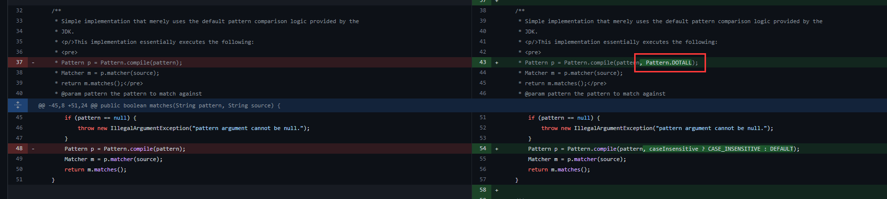
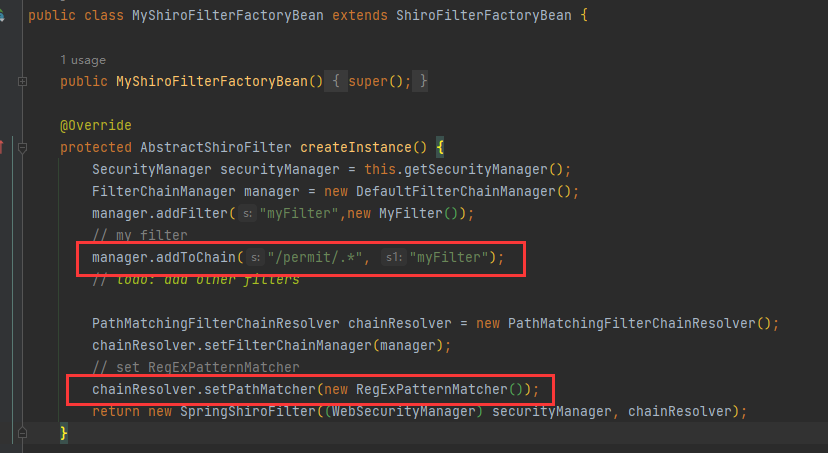
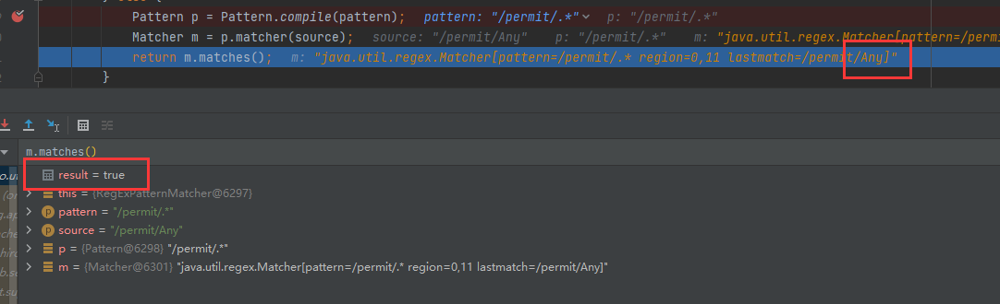
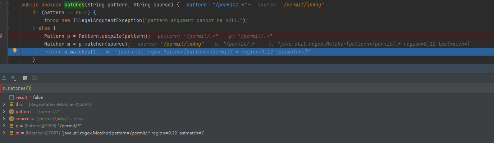

# CVE-2022-32532 Apache Shiro RegExPatternMatcher 权限绕过漏洞 复现分析

By. Whoopsunix

# 0x00 概述

与 Spring Security 认证绕过本质一样，都是因为 RegExPatternMatcher 是 Java 正则的默认实现，`.` 不会匹配 `\n、\r `，因此对于 `.*` 配置的路由可以绕过。

# 0x01 复现
/permit/%0AAny

/permit/%0dAny

# 0x02 补丁

https://github.com/apache/shiro/compare/shiro-root-1.9.0...shiro-root-1.9.1

添加 Pattern.DOTALL 对全部字符进行匹配

# 0x03 分析

ShiroFilterFactoryBean 中自定义了 `.*` 的路由匹配，载入默认正则匹配模式 RegExPatternMatcher

进入 org.apache.shiro.util.RegExPatternMatcher#matches() 打断点分析

`/permit/any` 路由需要验证，返回True

`/permit/%0aany`则返回为False，绕过验证

