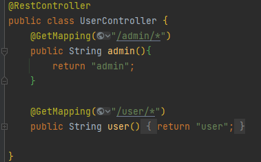
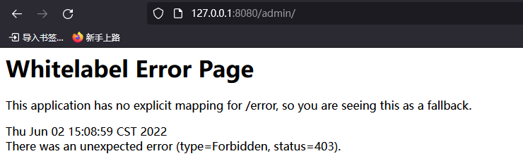
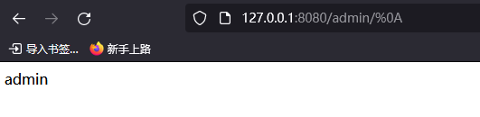
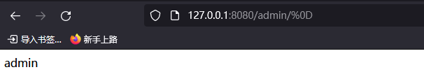
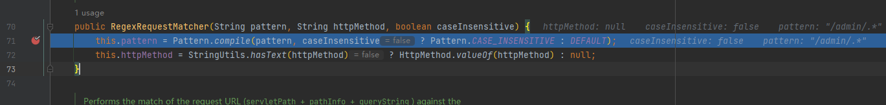
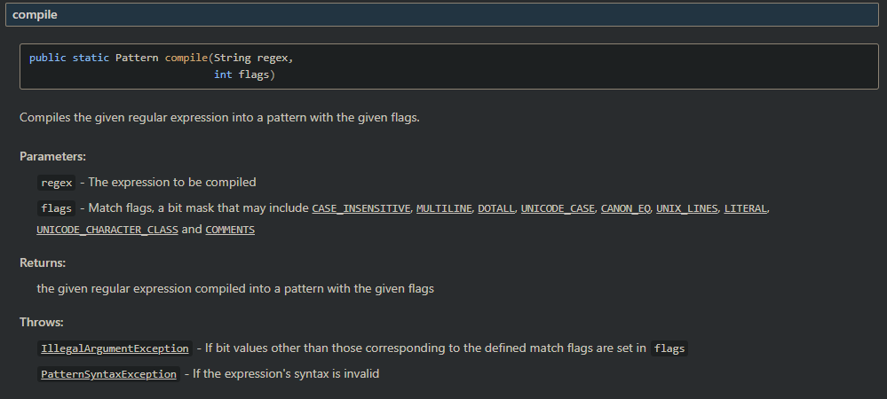
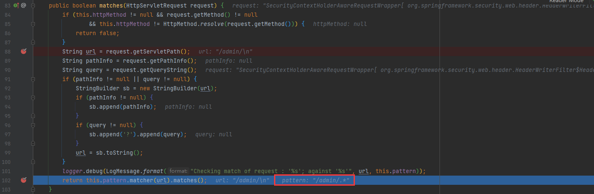

# CVE-2022-22978  Spring Security认证绕过 复现分析

# 0x00 概述

## 漏洞描述

## 影响范围

受影响版本：

5.5.0 <= Spring Security < 5.5.7

5.6.0 <= Spring Security < 5.6.4

Spring Security 更早的不受支持的版本

# 0x01 复现

spring security 对请求 servletPath 的身份校验，是通过 RegexRequestMatcher 的正则表达式来配置权限，当路由通过 * 进行匹配时可以绕过，如下是存在漏洞的一个例子。

直接访问403权限不足

使用回车或换行绕过（%0A 或 %0D ）

# 0x02 分析

## 初始化正则匹配模式

SpringSecurity 在项目初始化时，会将 servletPath 都传入 构造方法org.springframework.security.web.util.matcher.RegexRequestMatcher，这其中通过 Pattern.compile() 方法来初始化正则表达式。

Pattern.compile() 是 [jdk 中用来设定正则匹配标识的一个函数](https://devdocs.io/openjdk~8/java/util/regex/pattern#compile-java.lang.String-int-)，通过 flags 参数设置匹配模式

而其中的 flags 标志位是通过传入的 caseInsensitive 来设置的，caseInsensitive 为 false，因此使用默认模式匹配。

## 路由匹配位置

对于后续请求的路由，都将透过 org.springframework.security.web.util.matcher.RegexRequestMatcher#matches() 进行匹配，由于正则默认匹配模式中， `. 不会匹配\r\n`，会直接返回为 true ，因此绕过身份验证。

