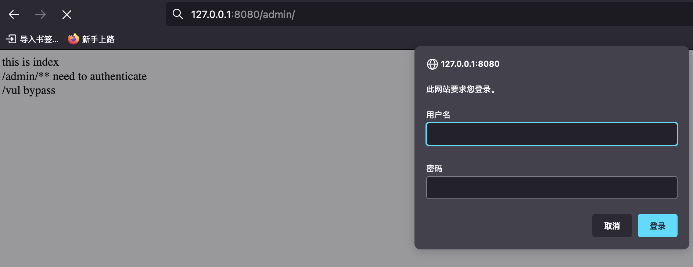
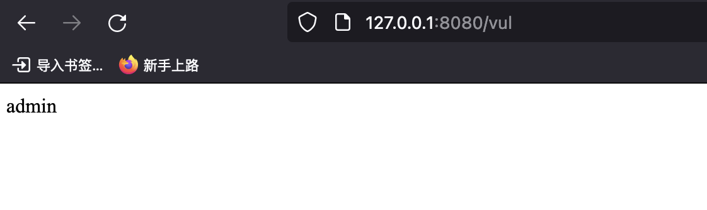

# CVE-2021-31692 Spring Security forward/include 认证绕过漏洞 复现分析

# 0x00 概述

实际利用场景较少

## 漏洞描述

当满足以下所有条件时，应用程序很容易受到攻击：

- 应用程序期望 Spring Security 应用安全性来 forward 和 include 调度程序类型。
- 应用程序手动或通过 authorizeHttpRequests 方法使用 AuthorizationFilter。
- 应用程序配置 FilterChainProxy 以应用 forward 和/或 include 请求。
- 应用程序将请求 forward / include 到更高权限的安全端点。
- 应用程序通过 authorizeHttpRequests().shouldFilterAllDispatcherTypes(true) 配置 Spring Security 以应用于每个调度程序类型

如果符合以下任意一项，则应用程序不会受到攻击：

- 应用程序不使用 authorizeHttpRequests 方法 或 AuthorizationFilter。
- 该应用程序不使用 forward / include 调度器处理请求。
- 应用程序不需要配置 Spring Security 来应用 forward 或 include 调度器类型。

## 影响范围

受影响版本：

5.7.0 <= Spring Security <= 5.7.4

5.6.0 <= Spring Security <= 5.6.8

安全版本：

Spring Security >= 5.7.5

Spring Security >= 5.6.9

# 0x01 复现

`/admin/**` 需要认证




`/vul` 绕过




# 0x02 补丁

https://github.com/spring-projects/spring-security/commit/1f481aafff14f324ffe2b43a973d3d5f54ae92d4

# 0x03 分析

这个洞利用要求较高，过一下补丁。可以看到 重写了AuthorizationFilter 从 OncePerRequestFilter 改成了 GenericFilterBean 即写定了几个配置的默认值并作出判断，与[通告](https://tanzu.vmware.com/security/cve-2022-31692) 中的缓解措施一致

```

private boolean observeOncePerRequest = true;

	private boolean filterErrorDispatch = false;

	private boolean filterAsyncDispatch = false;

```