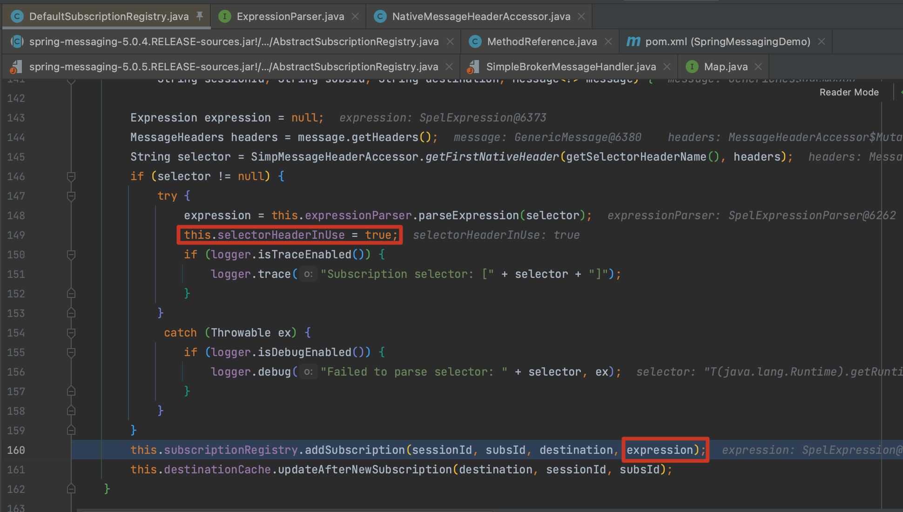
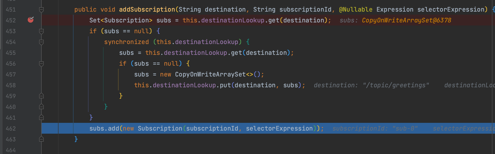
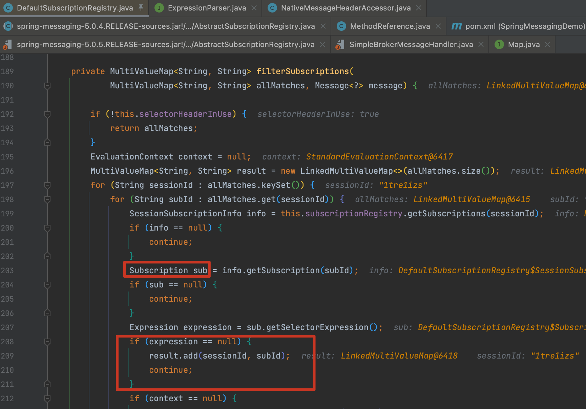
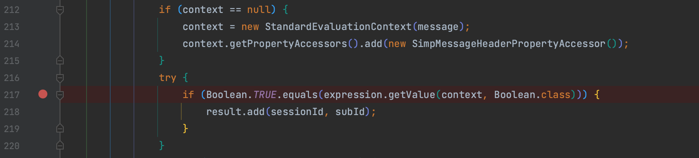
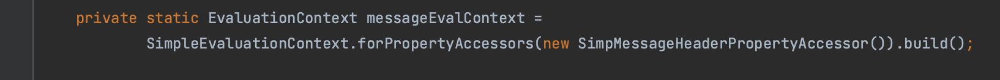

# CVE-2018-1270 & CVE-2018-1275 Spring Framework Spring-messaging存在远程代码执行漏洞分析

## 复现

1. 使用靶场，访问 http://127.0.0.1:8080/index.html  payload 位于 app.js 中
2. 点击 Connect
3. 点击 Send

## 分析

首先定位到 org.springframework.messaging.simp.broker.DefaultSubscriptionRegistry#addSubscriptionInternal 方法，在发起连接时，会判断 selector 值不为空时会将 `this.selectorHeaderInUse = true;` 设为 true，提取出表达式

表达式被封装为 Subscription

之后发起请求时，又触发到了 filterSubscriptions 方法，取出先前我们构造的含有恶意表达式的 sub

接下来使用了`StandardEvaluationContext` 作为表达式上下文，因此存在 SPEL 漏洞

补丁强制替换为 SimpleEvaluationContext

